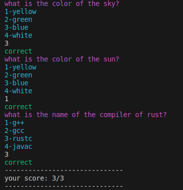

# Quiz Application

## Overview

This project is a simple quiz application written in Rust. It parses a file containing questions and multiple-choice answers, displays each question to the user, asks for an answer, and provides feedback on whether the answer is correct or incorrect. At the end of the quiz, the application displays the user's total score.

## Features

- Parses a text file containing questions and answers.
- Displays each question and multiple-choice options to the user.
- Accepts user input for answers.
- Provides feedback on whether the user's answer is correct or incorrect.
- Displays the user's total score at the end of the quiz.

## Example Output



## File Format
The questions file should be formatted as follows:
```text
question
1-option1
2-option2
3-option3
4-option4
correct_answer_number
```


## Usage

1. Ensure your questions file is properly formatted (as shown above).
2. Run your Rust project. It will parse the questions file, display each question, and interact with the user to collect answers and provide feedback.

## How to Run
```text
cargo run <path to questions file>
```
